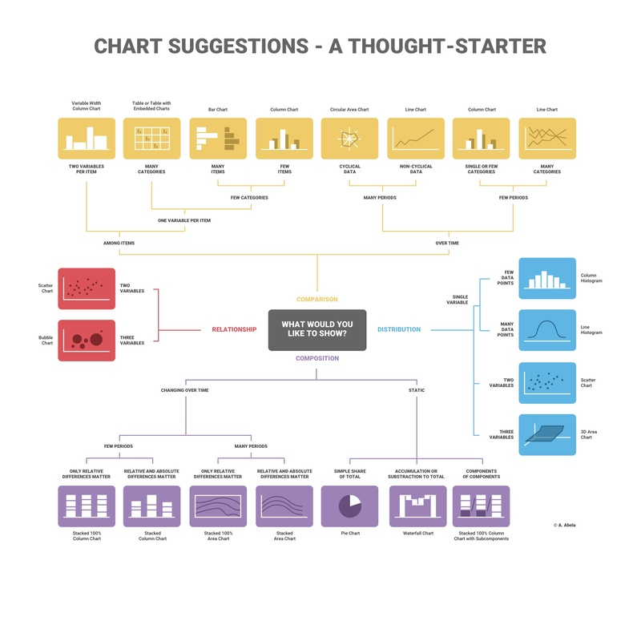

# Tata-IQ-Data-Visualisation-Internship-by-Forage
Dashboard created during data visualization internship by Forage

## Task 1: Framing the Business Scenario

**Working Resources:**
	

**Additional Resources:**
	
1. [Datapine - Article on how to think from the perspective of a CEO](https://www.datapine.com/blog/ceo-dashboard-report-examples-and-templates/)
2. [Asana - Article on metrics you should be tracking](https://asana.com/resources/success-metrics-examples)
3. [Scoro - Article on metrics that every company should know](https://www.scoro.com/blog/12-business-metrics/)

## Task 2: Choosing the Right Visuals

**Working Resources:**

1. Major Components of the Grammar of Graphics
	
2. [A Comprehensive Guide to the Grammar of Graphics for Effective Visualization of Multi-dimensional Data](https://towardsdatascience.com/a-comprehensive-guide-to-the-grammar-of-graphics-for-effective-visualization-of-multi-dimensional-1f92b4ed4149)
3. [How to choose the Right Chart for Data Visualization](https://www.analyticsvidhya.com/blog/2021/09/how-to-choose-the-right-chart-for-data-visualization/)
4. Chart Suggestions - A thought starter
   	
5. [How to Choose the Right Chart for Your Data](https://infogram.com/page/choose-the-right-chart-data-visualization)

**Additional Resources:**

1. [Ultimate Guide to Choosing the Right Visual](https://towardsdatascience.com/ultimate-guide-to-choosing-the-right-visual-2a77aa8eec08)
2. [How to Choose the Right Data Visualization]([https://towardsdatascience.com/ultimate-guide-to-choosing-the-right-visual-2a77aa8eec08](https://chartio.com/learn/charts/how-to-choose-data-visualization/)https://chartio.com/learn/charts/how-to-choose-data-visualization/)
3. [Which Type of Chart or Graph is Right for You?](https://www.tableau.com/learn/whitepapers/which-chart-or-graph-is-right-for-you)

## Task 3:

## Task 4:

## Task 5:
